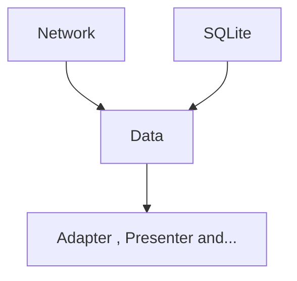
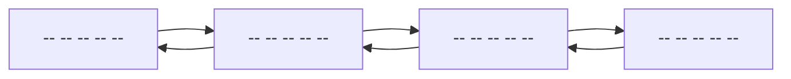
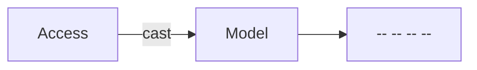
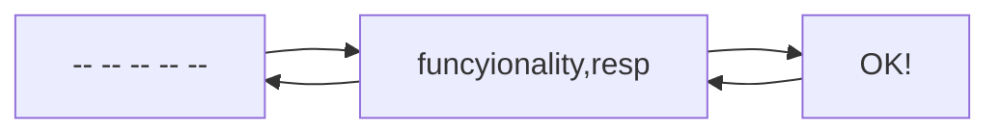
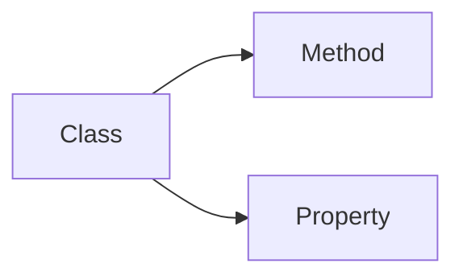
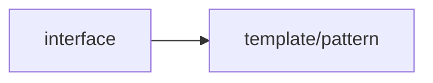
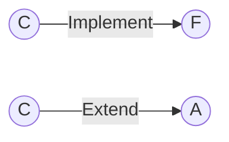

# Design Pattern
MVC, MVP, and MVVM are three popular design patterns in software development.
In this program we use MVP pattern.
## Model View Presenter (MVP)

#### Adapter
Its task is to convert arrays to Android list, memory management and …

### Configuration
Task of configuring application information, server address, token and …

### Data
Do catch.


 * available offline

### Fragment
This part will be removed.


* A multipurpose activity is used.


### Helper
Custom design programmer(font correction, etc).

### Models
An example of a database to form of class.


### Network
This is the task of communicating with the server and the network (Internet).
* Get
* Post 
* Put
* Delete
>Doing the HTTP main methods.

>Convert JSON to Array.

### Presenter
1. The task is to collect and sort things out and deliver for view.
2. Checking error
3. Performing functionality pragmatism.

                                 Presenter           View/Fragment/Activiy


 ### SQLite
  It has the task of communicating with the permanent storage of the program on the device.

  The task is to manage build databases and tables and update databases and tables and records.

  ```mermaid
  graph LR

  A[CRUD] -->Creat
  A --> Read
  A --> Update
  A --> Delete
  ```
### View

The task is to communicate between the presenter and the program's activities.

### Activity

The task is to communicate between graphic XML, UL / UX and presenter.


* C


* F

Abstract Class + a little of functionality.

F : All system users have method of the name + surname.

A : return Receive function = name + surname + age  .

C : 
>Student = return Student-code.

>employee = return income.